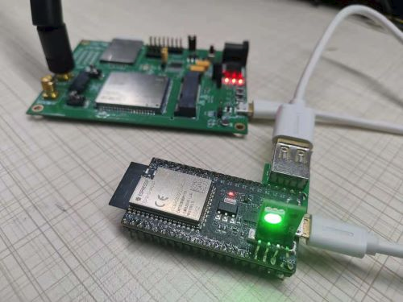
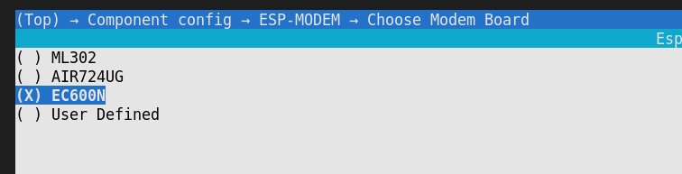

* [中文版本](README_cn.md)

# USB CDC 4G Module

This example demonstrates the ESP32-S2, ESP32-S3 series SoC as a USB host to dial-up 4G Cat.1 through PPP to access the Internet, with the help of ESP32-SX Wi-Fi softAP function, share the Internet with IoT devices or mobile devices. Realize low-cost "medium-high-speed" Internet access.It is also equipped with a router management interface, which allows you to configure the router online and view the information of connected devices.

**Features Supported:**

* USB CDC host communication
* Compatible with mainstream 4G module AT commands
* PPP dial-up
* Wi-Fi hotspot
* 4G module status management
* Router management interface
* Status led indicator



* [Demo video](https://b23.tv/8flUAS)

## Hardware requirement

**Supported ESP Soc:** 

* ESP32-S2
* ESP32-S3

> We recommend using ESP modules or chips that integrate 4MB above Flash, and 2MB above PSRAM. The example does not enable PSRAM by default, but users can add to tests by themselves. In theory, increasing the Wi-Fi buffer size can increase the average data throughput rate.

**Hardware wiring:**

Default GPIO as follows:

|        Functions         |  GPIO   |     Notes     |
| :----------------------: | :-----: | :-----------: |
|    **USB D+ (green)**    | **20**  | **Necessary** |
|    **USB D- (white)**    | **19**  | **Necessary** |
|     **GND (black)**      | **GND** | **Necessary** |
|      **+5V (red)**       | **+5V** | **Necessary** |
|   Modem Power Control    |   12    | Not Necessary |
| **Modem Reset Control**  | **13**  | **Necessary** |
| System Status LED (red)  |   15    | Not Necessary |
| Wi-Fi Status LED (blue)  |   17    | Not Necessary |
| Modem Status LED (green) |   16    | Not Necessary |

> User can change GPIO in `menuconfig -> 4G Modem Configuration -> gpio config`

## User Guide

**Wi-Fi SSID and Password:**

User can modify SSID and Password in `menuconfig -> 4G Modem Configuration -> WiFi soft AP `

1. Default Wi-Fi: `esp_4g_router`
2. Default Password: `12345678`

**LED Indicator Status:**

|     Indicator     |    Blink    |                Status                 |
| :---------------: | :---------: | :-----------------------------------: |
| **System (Red)**  | extinguish  |                  NA                   |
|                   | quick blink |           restart 4G Modem            |
|                   |    solid    | internal error(check SIM card please) |
| **Wi-Fi (Blue)**  | extinguish  |                  NA                   |
|                   | slow blink  |     waiting for device connection     |
|                   |    solid    |           device connected            |
| **Modem (Green)** | extinguish  |                  NA                   |
|                   | slow blink  |    waiting for internet connection    |
|                   |    solid    |          internet connected           |

**Router management interface**
You can configure whether to open the router management interface in `4G Modem Configuration → Web router config ` of `menuconfig`, and change the login account and password of the router management interface.

1. The default login account is `esp32`.
2. The default password is `12345678`.
3. Search `192.168.4.1` on the webpage to enter the router background
4. Currently supported features.
    * Support account login authentication
    * Support modify hotspot name, password, invisible or not, channel, bandwidth, security mode
    * Support to view the current connected device information, note the host name, a key to kick out the device
    * Support to view the network status and network time of the device

## How to build example

> You can also download then burn the firmware we have build. Download address: https://esp32.com/viewtopic.php?f=22&t=24468

1. Confirm that the `ESP-IDF` environment is successfully set up, and switch to the `release/v4.4` branch

2. Add the `ESP-IDF` environment variable, the Linux method is as follows, other platforms please refer [Set up the environment variables](https://docs.espressif.com/projects/esp-idf/en/latest/esp32/get-started/index.html#step-4-set-up-the-environment-variables)

    ```bash
    . $HOME/esp/esp-idf/export.sh
    ```

3. Set the IDF build target to `esp32s2` or `esp32s3`

    ```bash
    idf.py set-target esp32s2
    ```

4. Select the Cat.1 module model `Menuconfig → Component config → ESP-MODEM → Choose Modem Board`, if the your module is not in the list, please refer to `Other 4G Cat.1 Module Adaptation Methods` to configure.

    

5. Build, download, check log output

    ```bash
    idf.py build flash monitor
    ```

**Log**

```
I (9654) USB_HCDC: CDC Device Connected
I (9659) esp-modem: --------- Modem PreDefined Info ------------------
I (9666) esp-modem: Model: ML302-DNLM/CNLM
I (9671) esp-modem: Modem itf: IN Addr:0x81, OUT Addr:0x01
I (9677) esp-modem: ----------------------------------------------------
I (9684) gpio: GPIO[12]| InputEn: 0| OutputEn: 1| OpenDrain: 0| Pullup: 0| Pulldown: 0| Intr:0 
I (9694) gpio: GPIO[13]| InputEn: 0| OutputEn: 1| OpenDrain: 0| Pullup: 0| Pulldown: 0| Intr:0 
W (9704) USB_HCDC: rx0 flush -0 = 0
W (9707) modem_board: DTE reconnect, reconnecting ...

W (10713) modem_board: reconnect after 5s...
W (11713) modem_board: reconnect after 4s...
W (12713) modem_board: reconnect after 3s...
W (13713) modem_board: reconnect after 2s...
W (14713) modem_board: reconnect after 1s...
I (14713) modem_board: Modem state STAGE_SYNC, Start
W (14824) modem_board: Network Auto reconnecting ...
I (14824) modem_board: Modem state STAGE_SYNC, Success!
I (14924) modem_board: Modem state STAGE_CHECK_SIM, Start
I (14958) modem_board: SIM Card Ready
I (14958) modem_board: Modem state STAGE_CHECK_SIM, Success!
I (15058) modem_board: Modem state STAGE_CHECK_SIGNAL, Start
I (15081) modem_board: Signal quality: rssi=25, ber=99
I (15081) modem_board: Modem state STAGE_CHECK_SIGNAL, Success!
I (15182) modem_board: Modem state STAGE_CHECK_REGIST, Start
I (15205) modem_board: Network registed, Operator: "46000"
I (15205) modem_board: Modem state STAGE_CHECK_REGIST, Success!
I (15306) modem_board: Modem state STAGE_START_PPP, Start
I (15715) modem_board: Modem state STAGE_START_PPP, Success!
W (15716) modem_board: Modem event! 0
I (15727) esp-netif_lwip-ppp: Connected
I (15727) esp-netif_lwip-ppp: Name Server1: 211.136.150.86
I (15727) esp-netif_lwip-ppp: Name Server2: 0.0.0.0
I (15732) modem_board: IP event! 6
I (15736) modem_board: Modem Connected to PPP Server
I (15742) modem_board: ppp ip: 10.84.162.74, mask: 255.255.255.255, gw: 192.168.0.1
I (15750) modem_board: Main DNS: 211.136.150.86
I (15755) modem_board: Backup DNS: 0.0.0.0
I (15761) pp: pp rom version: e7ae62f
I (15765) net80211: net80211 rom version: e7ae62f
I (15771) wifi:wifi driver task: 3fcb04d8, prio:23, stack:6656, core=0
I (15776) system_api: Base MAC address is not set
I (15781) system_api: read default base MAC address from EFUSE
I (15798) wifi:wifi firmware version: 133d2ca
I (15798) wifi:wifi certification version: v7.0
I (15799) wifi:config NVS flash: enabled
I (15800) wifi:config nano formating: disabled
I (15804) wifi:Init data frame dynamic rx buffer num: 32
I (15809) wifi:Init management frame dynamic rx buffer num: 32
I (15815) wifi:Init management short buffer num: 32
I (15815) modem_board: Modem state STAGE_WAIT_IP, Start
I (15819) wifi:Init dynamic tx buffer num: 32
I (15825) modem_board: Modem state STAGE_WAIT_IP, Success!
I (15829) wifi:Init static tx FG buffer num: 2
I (15840) wifi:Init static rx buffer size: 1600
I (15844) wifi:Init static rx buffer num: 10
I (15848) wifi:Init dynamic rx buffer num: 32
I (15852) wifi_init: tcpip mbox: 32
I (15856) wifi_init: udp mbox: 6
I (15860) wifi_init: tcp mbox: 6
I (15864) wifi_init: tcp tx win: 5744
I (15868) wifi_init: tcp rx win: 5744
I (15873) wifi_init: tcp mss: 1440
I (15877) wifi_init: WiFi IRAM OP enabled
I (15881) wifi_init: WiFi RX IRAM OP enabled
I (15886) wifi_init: LWIP IRAM OP enabled
I (15892) phy_init: phy_version 503,13653eb,Jun  1 2022,17:47:08
I (15931) wifi:mode : softAP (7c:df:a1:e0:91:01)
I (15934) wifi:Total power save buffer number: 16
I (15934) wifi:Init max length of beacon: 752/752
I (15934) wifi:Init max length of beacon: 752/752
I (15939) modem_wifi: Wi-Fi AP started
I (15947) wifi:Total power save buffer number: 16
I (15948) modem_wifi: softap ssid: esp_4g_router password: 12345678
I (15954) modem_wifi: NAT is enabled
```

## Debugging method 

**1. Debugging mode**

Enable the `4G Modem Configuration -> Dump system task status` option in `menuconfig` to print task detailed information, or open the `Component config → USB Host CDC ->Trace internal memory status` option to print usb internal buffer usage information.

	```
    I (79530) main: Task dump
    I (79531) main: Load    Stack left      Name    PRI
    I (79531) main: 3.24    1080    main    1
    I (79532) main: 95.25   1248    IDLE    0
    I (79536) main: 0.03    1508    bulk-out        6
    I (79541) main: 0.03    1540    port    9
    I (79546) main: 0.01    1752    Tmr Svc         1
    I (79550) main: 0.04    2696    tiT     18
    I (79554) main: 1.21    1352    usb_event       4
    I (79559) main: 0.01    1532    bulk-in         5
    I (79564) main: 0.05    3540    esp_timer       22
    I (79569) main: 0.13    4632    wifi    23
    I (79573) main: 0.00    1532    dflt    8
    I (79577) main: 0.00    1092    sys_evt         20
    I (79582) main: Free heap=37088 bigst=16384, internal=36968 bigst=16384
    I (79589) main: ..............
    
    I (79593) USB_HCDC: USBH CDC Transfer Buffer Dump:
    I (79599) USB_HCDC: usb transfer Buffer size, out = 3000, in = 1500
    I (79606) USB_HCDC: usb transfer Max packet size, out = 46, in = 48
    
    I (79613) USB_HCDC: USBH CDC Ringbuffer Dump:
    I (79618) USB_HCDC: usb ringbuffer size, out = 15360, in = 15360
    I (79625) USB_HCDC: usb ringbuffer High water mark, out = 46, in = 48
	```

**2. Performance optimization**

1. If there is a requirement for throughput, please select the `FDD` standard module and operator;
2. Modify `APN` to the name provided by the operator `menuconfig -> 4G Modem Configuration -> Set Modem APN`, for example, when using China Mobile's ordinary 4G card, it can be changed to `cmnet`;
3. Configure ESP32-Sx CPU to 240MHz (`Component config → ESP32S2-specific → CPU frequency`), if it supports dual cores, please turn on both cores at the same time;
4. Add and enable PSRAM (`Component config → ESP32S2-specific → Support for external`), and increase the PSRAM clock frequency (`Component config → ESP32S2-specific → Support for external → SPI RAM config → Set RAM clock speed`) select 80MHz. And open `Try to allocate memories of WiFi and LWIP in SPIRAM firstly.` in this directory;
5. Increase the FreeRTOS Tick frequency `Component config → FreeRTOS → Tick rate` to `1000 Hz`;
6. Optimization of other application layers.

## Performance test

**Test environment:**

* ESP32-S2, CPU 240 MHz
* 4 MB flash, no PSRAM
* ML302-DNLM module
* China Mobile 4G SIM card
* Normal office environment

**Test result:**

| Test item |   Peak   | Average |
| :-------: | :------: | :-----: |
| Download  | 6.4 Mbps | 4 Mbps  |
|  Upload   |  5 Mbps  | 2 Mbps  |

> **4G Cat.1 theoretical peak download rate is 10 Mbps, peak upload rate is 5 Mbps**
> The actual communication rate is affected by the operator's network, test software, Wi-Fi interference, and the number of terminal connections, etc.
