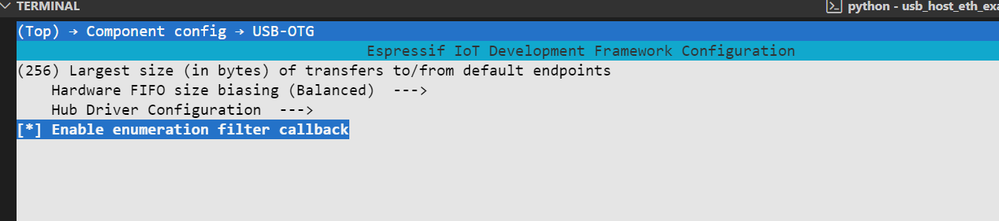

| Supported Targets | ESP32-P4 | ESP32-S2 | ESP32-S3 |
| ----------------- | -------- | -------- | -------- |

# USB Host CDC Ethernet Example

> 对于 CH397A， 请在 menuconfig 中启用 `CONFIG_USB_HOST_ENABLE_ENUM_FILTER_CALLBACK`




# Log

```
I (341) main_task: Calling app_main()
I (341) USB-CDC: Installing USB Host
I (371) USB-CDC: Installing CDC-ACM driver
I (371) USB-ETH: USB ECM MAC: b4:3a:45:10:7c:d6
I (371) USB-ETH: USB ECM network interface initialized
I (371) USB-CDC: Trying to connect to USB ECM device
I (371) USB-ETH: Opening CDC ACM device 0x1A86:0x5397...
W (751) ENUM: Device has more than 1 configuration
USB device configuration value set to 2
Found INTR EP 0x81 interface 0 
Found 3 functional descriptors
Found Bulk IN endpoint 0x82 interface 1 
Found Bulk OUT endpoint 0x03 interface 1 
claiming interface 1 - alternate 1
*** Device descriptor ***
bLength 18
bDescriptorType 1
bcdUSB 2.00
bDeviceClass 0x0
bDeviceSubClass 0x0
bDeviceProtocol 0x0
bMaxPacketSize0 64
idVendor 0x1a86
idProduct 0x5397
bcdDevice 7.50
iManufacturer 1
iProduct 2
iSerialNumber 3
bNumConfigurations 3
*** Configuration descriptor ***
bLength 9
bDescriptorType 2
wTotalLength 80
bNumInterfaces 2
bConfigurationValue 2
iConfiguration 0
bmAttributes 0xa0
bMaxPower 100mA
        *** Interface descriptor ***
        bLength 9
        bDescriptorType 4
        bInterfaceNumber 0
        bAlternateSetting 0
        bNumEndpoints 1
        bInterfaceClass 0x2
        bInterfaceSubClass 0x6
        bInterfaceProtocol 0x0
        iInterface 5
        *** CDC Header Descriptor ***
        bcdCDC: 1.10
        *** CDC Union Descriptor ***
        bControlInterface: 0
        bSubordinateInterface[0]: 1
W (851) cdc_acm: Unsupported CDC specific descriptor
                *** Endpoint descriptor ***
                bLength 7
                bDescriptorType 5
                bEndpointAddress 0x81   EP 1 IN
                bmAttributes 0x3        INT
                wMaxPacketSize 64
                bInterval 8
        *** Interface descriptor ***
        bLength 9
        bDescriptorType 4
        bInterfaceNumber 1
        bAlternateSetting 0
        bNumEndpoints 0
        bInterfaceClass 0xa
        bInterfaceSubClass 0x0
        bInterfaceProtocol 0x0
        iInterface 0
        *** Interface descriptor ***
        bLength 9
        bDescriptorType 4
        bInterfaceNumber 1
        bAlternateSetting 1
        bNumEndpoints 2
        bInterfaceClass 0xa
        bInterfaceSubClass 0x0
        bInterfaceProtocol 0x0
        iInterface 0
                *** Endpoint descriptor ***
                bLength 7
                bDescriptorType 5
                bEndpointAddress 0x82   EP 2 IN
                bmAttributes 0x2        BULK
                wMaxPacketSize 64
                bInterval 0
                *** Endpoint descriptor ***
                bLength 7
                bDescriptorType 5
                bEndpointAddress 0x3    EP 3 OUT
                bmAttributes 0x2        BULK
                wMaxPacketSize 64
                bInterval 0
I (931) USB-ETH: Setting ETHERNET packet filter
I (941) USB-ETH: Setting interface alternate setting to 1
I (2351) USB-ETH: Network connected
I (3361) USB-ETH: Ethernet Got IP Address
I (3361) USB-ETH: ~~~~~~~~~~~
I (3361) USB-ETH: ETHIP:192.168.10.54
I (3361) USB-ETH: ETHMASK:255.255.255.0
I (3361) USB-ETH: ETHGW:192.168.10.1
I (3361) USB-ETH: ~~~~~~~~~~~
I (3441) USB-ETH: USB ECM connected and running!
I (3441) USB-CDC: Starting ping test task
I (3441) USB-CDC: Starting continuous ping test to 8.8.8.8
I (3441) USB-CDC: Ping test task started successfully
I (3501) USB-CDC: Ping success - 64 bytes from 8.8.8.8 icmp_seq=1 ttl=118 time=60 ms
I (6491) USB-CDC: Ping success - 64 bytes from 8.8.8.8 icmp_seq=2 ttl=118 time=58 ms
I (9501) USB-CDC: Ping success - 64 bytes from 8.8.8.8 icmp_seq=3 ttl=118 time=59 ms
```