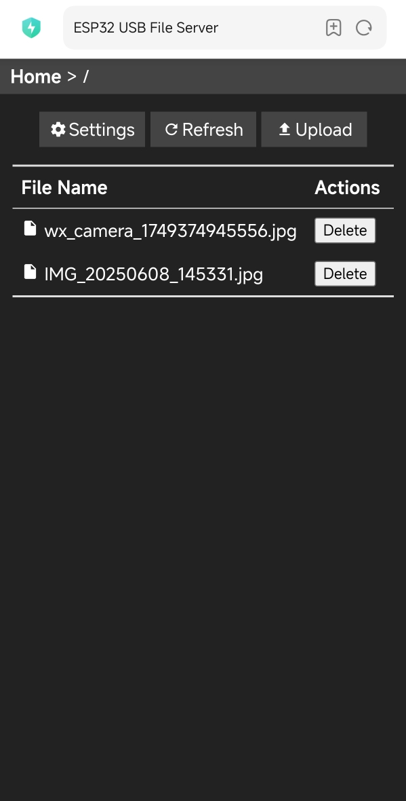

# USB Host MSC Example

This example demonstrates how to use USB Host MSC functionality and provides a web page to manage MSC devices.

## Hardware Requirements

- ESP32 chip that supports USB OTG, such as ESP32-S2, ESP32-S3, ESP32-P4
- A USB flash drive formatted as FAT32/exFAT

### exFat Support (Not Enabled by Default)

* To enable exFat support, set the `FF_FS_EXFAT` macro to `1` in the `components/fatfs/src/ffconf.h` file of the esp-idf SDK directory

* Also set the macros `CONFIG_FATFS_LFN_HEAP` to `y` and `CONFIG_FATFS_USE_LABEL` to `y`

Note: exFat requires a paid license.

## Web Page Features

- Display files and directories on the MSC device
- Upload files to the MSC device
- Download files from the MSC device
- Delete files from the MSC device
- Configure Wi-Fi network settings



## How to Use

1. Insert the USB flash drive into the development board's USB port, ensure it's properly powered
2. Connect to the default Wi-Fi network `ESP-Host-MSC-Demo` with no password
3. Open a browser and visit `http://192.168.4.1` to access the file management page

## Example Output

```
I (389) main_task: Started on CPU0
I (409) main_task: Calling app_main()
I (439) esp_msc_host: Waiting for USB stick to be connected
I (439) esp_msc_host: MSC Host Install Done
I (449) wifi: wifimode : Can't find in NVS!
I (449) pp: pp rom version: e7ae62f
I (449) net80211: net80211 rom version: e7ae62f
I (469) wifi:wifi driver task: 3fcab1c0, prio:23, stack:6656, core=0
I (469) wifi:wifi firmware version: d6750df
I (469) wifi:wifi certification version: v7.0
I (469) wifi:config NVS flash: enabled
I (469) wifi:config nano formatting: disabled
I (479) wifi:Init data frame dynamic rx buffer num: 32
I (479) wifi:Init static rx mgmt buffer num: 5
I (489) wifi:Init management short buffer num: 32
I (489) wifi:Init dynamic tx buffer num: 32
I (489) wifi:Init static tx FG buffer num: 2
I (499) wifi:Init static rx buffer size: 1600
I (499) wifi:Init static rx buffer num: 10
I (509) wifi:Init dynamic rx buffer num: 32
I (509) wifi_init: rx ba win: 6
I (509) wifi_init: accept mbox: 6
I (519) wifi_init: tcpip mbox: 32
I (519) wifi_init: udp mbox: 6
I (519) wifi_init: tcp mbox: 6
I (519) wifi_init: tcp tx win: 5760
I (529) wifi_init: tcp rx win: 5760
I (529) wifi_init: tcp mss: 1440
I (529) wifi_init: WiFi IRAM OP enabled
I (539) wifi_init: WiFi RX IRAM OP enabled
I (549) wifi: wifi_init_softap finished.SSID:ESP-Host-MSC-Demo password:
I (549) phy_init: phy_version 701,f4f1da3a,Mar  3 2025,15:50:10
I (609) phy_init: Saving new calibration data due to checksum failure or outdated calibration data, mode(0)
I (629) wifi:mode : softAP (30:30:f9:5a:8e:89)
I (629) wifi:Total power save buffer number: 16
I (629) wifi:Init max length of beacon: 752/752
I (629) wifi:Init max length of beacon: 752/752
I (629) file_server: Starting HTTP Server
I (629) esp_netif_lwip: DHCP server started on interface WIFI_AP_DEF with IP: 192.168.4.1
I (649) main_task: Returned from app_main()
I (819) esp_msc_host: MSC device connected
I (819) esp_msc_host: connection...
*** Device descriptor ***
bLength 18
bDescriptorType 1
bcdUSB 2.10
bDeviceClass 0x0
bDeviceSubClass 0x0
bDeviceProtocol 0x0
bMaxPacketSize0 64
idVendor 0x2537
idProduct 0x1081
bcdDevice 1.00
iManufacturer 1
iProduct 2
iSerialNumber 3
bNumConfigurations 1
*** Configuration descriptor ***
bLength 9
bDescriptorType 2
wTotalLength 32
bNumInterfaces 1
bConfigurationValue 1
iConfiguration 0
bmAttributes 0x80
bMaxPower 100mA
        *** Interface descriptor ***
        bLength 9
        bDescriptorType 4
        bInterfaceNumber 0
        bAlternateSetting 0
        bNumEndpoints 2
        bInterfaceClass 0x8
        bInterfaceSubClass 0x6
        bInterfaceProtocol 0x50
        iInterface 0
                *** Endpoint descriptor ***
                bLength 7
                bDescriptorType 5
                bEndpointAddress 0x81   EP 1 IN
                bmAttributes 0x2        BULK
                wMaxPacketSize 64
                bInterval 0
                *** Endpoint descriptor ***
                bLength 7
                bDescriptorType 5
                bEndpointAddress 0x2    EP 2 OUT
                bmAttributes 0x2        BULK
                wMaxPacketSize 64
                bInterval 0
Device info:
         Capacity: 118911 MB
         Sector size: 512
         Sector count: 243531775
         PID: 0x1081
         VID: 0x2537
         iProduct: NS1081
         iManufacturer: Norelsys
         iSerialNumber: 4680D02F27E1
```
